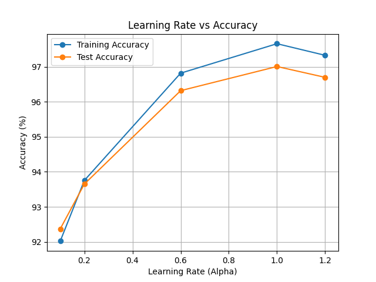
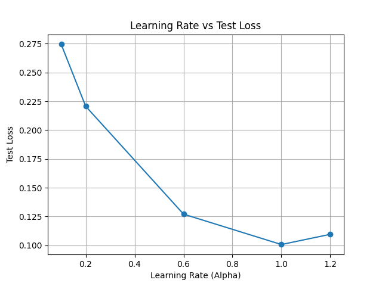
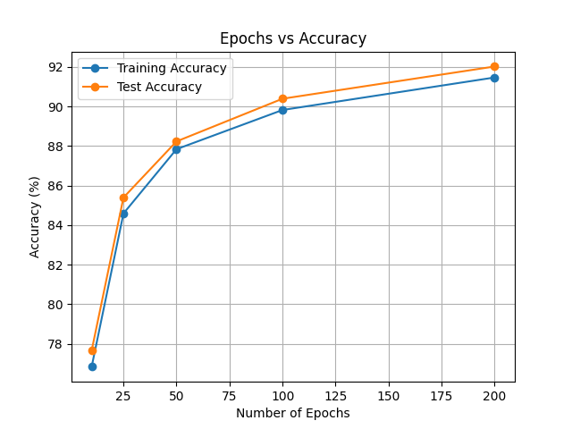
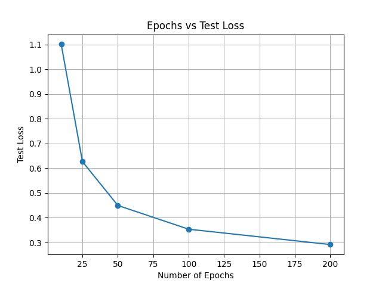
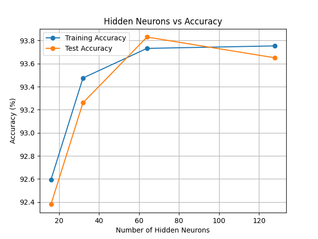
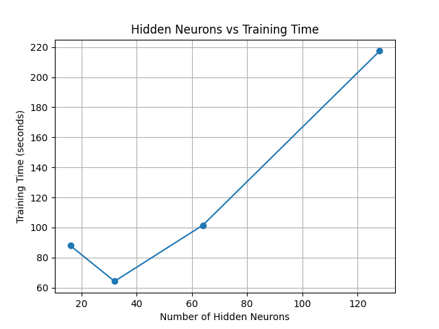

# MNIST Neural Network From Scratch

A handwritten digit classification project using the MNIST dataset.

The neural network is implemented from scratch using NumPy without TensorFlow, PyTorch, Keras, or automatic differentiation.

The project also investigates how different neural-network hyperparameters affect model performance.

## Objective

The main objective of this project is to understand the mathematical operations behind a neural network by manually implementing:

* Weight and bias initialization
* Forward propagation
* ReLU activation
* Softmax activation
* One-hot encoding
* Cross-entropy loss
* Backpropagation
* Gradient descent
* Model evaluation

The model is trained to recognize handwritten digits from 0 to 9.

## Dataset

The MNIST dataset contains grayscale images of handwritten digits.

Each image has a size of:

```text
28 × 28 pixels
```

Therefore each image contains:

```text
784 pixel values
```

The pixel values are normalized from:

```text
0–255
```

to:

```text
0–1
```

before being passed to the neural network.

## Neural Network Architecture

The basic network contains one hidden layer.

```text
28 × 28 MNIST Image
        ↓
784 Input Neurons
        ↓
Hidden Layer
        ↓
ReLU
        ↓
10 Output Neurons
        ↓
Softmax
        ↓
Predicted Digit
```

The 10 output neurons represent the digits:

```text
0 1 2 3 4 5 6 7 8 9
```

The class with the largest Softmax probability is selected as the predicted digit.

## Training Process

The model is trained using the following process:

```text
Input Image
    ↓
Forward Propagation
    ↓
Prediction
    ↓
Calculate Loss
    ↓
Backpropagation
    ↓
Calculate Gradients
    ↓
Update Weights and Biases
    ↓
Repeat
```

Gradient descent is used to update the neural-network parameters.

## Hyperparameter Experiments

Three main hyperparameters are investigated.

### Learning Rate

Different learning rates are tested while keeping the number of epochs and hidden neurons constant.

This experiment investigates how the step size used during gradient descent affects learning.

### Number of Epochs

Different numbers of training epochs are tested while keeping the learning rate and hidden-layer size constant.

This experiment shows how model performance changes as the network receives more training.

### Number of Hidden Neurons

Different hidden-layer sizes are tested while keeping the learning rate and number of epochs constant.

This experiment investigates how increasing the capacity of the neural network affects accuracy and training time.

## Metrics

The following values are recorded during the experiments:

* Training accuracy
* Test accuracy
* Cross-entropy loss
* Training time

## Experiment Results

### Learning Rate vs Accuracy



### Learning Rate vs Loss



### Epochs vs Accuracy



### Epochs vs Loss



### Hidden Neurons vs Accuracy



### Hidden Neurons vs Training Time



## Project Structure

```text
mnist-neural-network-from-scratch/
│
├── README.md
├── requirements.txt
├── results.txt
│
├── Codes/
│   ├── MNIST.py
│   └── Experiments.py
│
└── Results/
    ├── Figure_1.png
    ├── Figure_2.png
    ├── Figure_3.png
    ├── Figure_4.png
    ├── Figure_5.png
    └── Figure_6.png
```

## Installation

Clone the repository and install the required Python packages:

```bash
pip install -r requirements.txt
```

Required libraries:

```text
NumPy
Pandas
Matplotlib
```

## Dataset Setup

Place the MNIST CSV files in the project directory:

```text
mnist_train.csv
mnist_test.csv
```

The dataset files are not included directly in this repository.

## Run the Neural Network

To train and test the basic neural network:

```bash
python Codes/MNIST.py
```

To run the hyperparameter experiments:

```bash
python Codes/Experiments.py
```

## Technologies

Python is used as the programming language.

NumPy is used for matrix calculations and the mathematical implementation of the neural network.

Pandas is used for loading and organizing the MNIST CSV data.

Matplotlib is used to visualize the experimental results.

## Key Learning Outcomes

This project demonstrates how a neural network can be implemented without using a deep-learning framework.

It provides practical understanding of:

```text
Forward propagation
Backpropagation
Gradient descent
Activation functions
Loss calculation
Hyperparameter tuning
Model evaluation
```

## Future Improvements

Possible future improvements include:

```text
Mini-batch gradient descent
Multiple hidden layers
Improved weight initialization
Learning-rate scheduling
Saving and loading trained weights
Confusion matrix
Individual digit visualization
Comparison with CNN models
```
